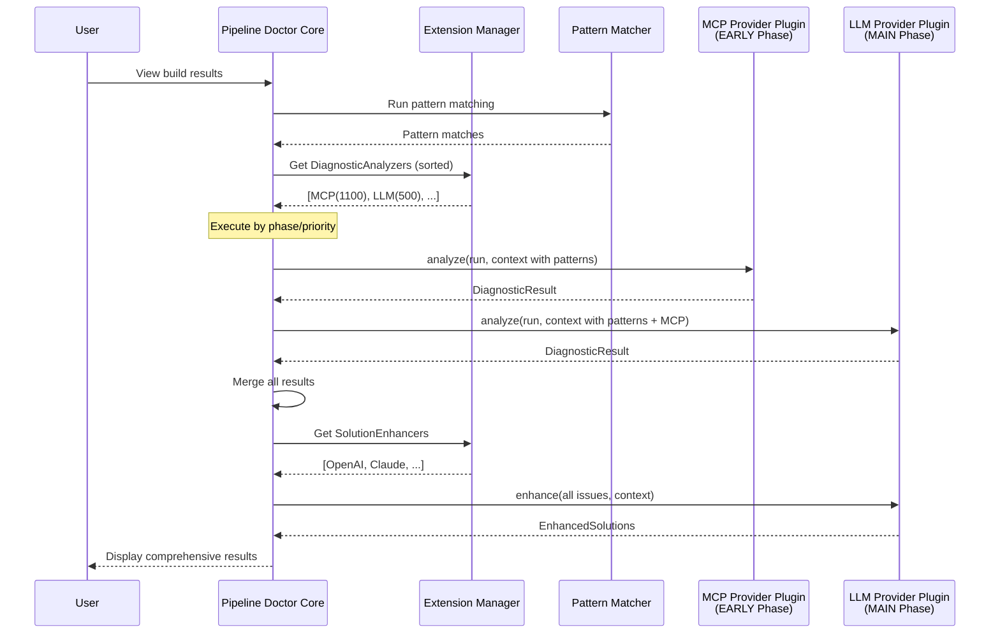

# Jenkins Extension Point Architecture for MCP and LLM Integration

## Overview

Instead of bundling MCP and LLM functionality directly in the Pipeline Doctor plugin, we'll expose Jenkins extension points that allow other plugins to provide these capabilities. This creates a more flexible, modular architecture.

## Architecture Design

### Core Plugin Responsibilities

The Pipeline Doctor core plugin will:
1. Provide built-in pattern matching for common issues
2. Define extension points for external analysis providers
3. Orchestrate the analysis flow
4. Present unified results to users
5. Handle configuration and job-level settings

### Extension Points

#### 1. `DiagnosticAnalyzer` Extension Point

```java
package io.jenkins.plugins.pipelinedoctor.api;

import hudson.ExtensionPoint;
import hudson.model.Describable;
import hudson.model.Descriptor;
import hudson.model.Run;
import java.util.List;
import java.util.concurrent.CompletableFuture;

/**
 * Extension point for external diagnostic analyzers (MCP, LLM, etc.)
 */
public abstract class DiagnosticAnalyzer implements ExtensionPoint, Describable<DiagnosticAnalyzer> {
    
    /**
     * Execution phases for analyzers to ensure proper ordering
     */
    public enum Phase {
        /**
         * Early phase - runs immediately after pattern matching (e.g., MCP)
         * These analyzers can provide additional context for later phases
         */
        EARLY(1000),
        
        /**
         * Main phase - general analysis (default for most analyzers)
         */
        MAIN(500),
        
        /**
         * Late phase - runs after other analyzers (e.g., aggregators)
         */
        LATE(100);
        
        private final int basePriority;
        
        Phase(int basePriority) {
            this.basePriority = basePriority;
        }
        
        public int getBasePriority() {
            return basePriority;
        }
    }
    
    /**
     * Analyze build logs and return diagnostic results
     * 
     * @param run The build run to analyze
     * @param context Analysis context with logs, patterns found, etc.
     * @return Future containing diagnostic results
     */
    public abstract CompletableFuture<DiagnosticResult> analyze(
        Run<?, ?> run, 
        AnalysisContext context
    );
    
    /**
     * Check if this analyzer is enabled for the given run
     */
    public abstract boolean isApplicable(Run<?, ?> run);
    
    /**
     * Get the execution phase for this analyzer
     * @return The phase when this analyzer should run
     */
    public Phase getPhase() {
        return Phase.MAIN;
    }
    
    /**
     * Get analyzer priority within its phase (higher = runs first)
     * Priority is calculated as: phase.basePriority + getPriority()
     */
    public int getPriority() {
        return 0;
    }
    
    /**
     * Get the effective execution order priority
     */
    public final int getExecutionPriority() {
        return getPhase().getBasePriority() + getPriority();
    }
    
    /**
     * Dependencies on other analyzers (by class name)
     * This analyzer will wait for specified analyzers to complete first
     */
    public List<String> getDependencies() {
        return Collections.emptyList();
    }
    
    /**
     * Get display name for UI
     */
    public abstract String getDisplayName();
}
```

#### 2. `SolutionEnhancer` Extension Point

```java
package io.jenkins.plugins.pipelinedoctor.api;

import hudson.ExtensionPoint;
import java.util.List;
import java.util.concurrent.CompletableFuture;

/**
 * Extension point for enhancing solutions with detailed explanations
 */
public abstract class SolutionEnhancer implements ExtensionPoint {
    
    /**
     * Enhance solutions with additional context and explanations
     * 
     * @param issues List of identified issues
     * @param context Enhancement context
     * @return Future containing enhanced solutions
     */
    public abstract CompletableFuture<List<EnhancedSolution>> enhance(
        List<DiagnosticIssue> issues,
        EnhancementContext context
    );
    
    /**
     * Check if this enhancer is enabled
     */
    public abstract boolean isEnabled();
    
    /**
     * Get enhancer configuration
     */
    public abstract EnhancerConfiguration getConfiguration();
}
```

### Data Models

#### AnalysisContext

```java
public class AnalysisContext {
    private final String buildLog;
    private final List<PatternMatch> patternMatches;
    private final Map<String, DiagnosticResult> previousResults;
    private final Map<String, Object> metadata;
    private final JobConfiguration jobConfig;
    
    /**
     * Get results from analyzers that have already run
     * Useful for analyzers that depend on others
     */
    public Optional<DiagnosticResult> getPreviousResult(String analyzerId) {
        return Optional.ofNullable(previousResults.get(analyzerId));
    }
    
    /**
     * Get all results from a specific phase
     */
    public List<DiagnosticResult> getResultsFromPhase(Phase phase) {
        return previousResults.values().stream()
            .filter(r -> r.getPhase() == phase)
            .collect(Collectors.toList());
    }
    
    // Other getters, builder pattern...
}
```

#### DiagnosticResult

```java
public class DiagnosticResult {
    private final String analyzerId;
    private final List<DiagnosticIssue> issues;
    private final long analysisTimeMs;
    private final Map<String, Object> metadata;
    
    // Getters, builder pattern...
}
```

## Implementation Examples

### MCP Provider Plugin

A separate plugin `pipeline-doctor-mcp` would implement the `DiagnosticAnalyzer`:

```java
@Extension
public class MCPDiagnosticAnalyzer extends DiagnosticAnalyzer {
    
    @Override
    public Phase getPhase() {
        // MCP runs in EARLY phase, right after pattern matching
        return Phase.EARLY;
    }
    
    @Override
    public int getPriority() {
        // High priority within EARLY phase
        return 100;
    }
    
    @Override
    public CompletableFuture<DiagnosticResult> analyze(Run<?, ?> run, AnalysisContext context) {
        MCPConfiguration config = getMCPConfiguration(run);
        if (config == null) {
            return CompletableFuture.completedFuture(DiagnosticResult.empty());
        }
        
        return CompletableFuture.supplyAsync(() -> {
            // Context includes pattern matches from core plugin
            List<PatternMatch> patterns = context.getPatternMatches();
            
            // Connect to MCP server
            // Send analysis request with pattern context
            // Parse response into DiagnosticResult
            return result;
        });
    }
    
    @Override
    public boolean isApplicable(Run<?, ?> run) {
        // Check if MCP is configured for this job/folder
        return MCPConfiguration.isConfigured(run);
    }
    
    @Override
    public Descriptor<DiagnosticAnalyzer> getDescriptor() {
        return new DescriptorImpl();
    }
    
    @Extension
    public static class DescriptorImpl extends Descriptor<DiagnosticAnalyzer> {
        @Override
        public String getDisplayName() {
            return "MCP Diagnostic Analyzer";
        }
    }
}
```

### LLM Provider Plugin

A separate plugin `pipeline-doctor-openai` would implement both extension points:

```java
@Extension
public class OpenAIDiagnosticAnalyzer extends DiagnosticAnalyzer {
    
    @Override
    public Phase getPhase() {
        // LLM analysis runs in MAIN phase
        return Phase.MAIN;
    }
    
    @Override
    public List<String> getDependencies() {
        // Can depend on MCP analyzer if available
        return Arrays.asList("MCPDiagnosticAnalyzer");
    }
    
    @Override
    public CompletableFuture<DiagnosticResult> analyze(Run<?, ?> run, AnalysisContext context) {
        // Implementation for log analysis
        // Has access to both pattern matches and MCP results
    }
}

@Extension
public class OpenAISolutionEnhancer extends SolutionEnhancer {
    // Implementation for solution enhancement
}
```

## Configuration Management

### Global Configuration

Each provider plugin manages its own global configuration:

```java
@Extension
public class MCPGlobalConfiguration extends GlobalConfiguration {
    private List<MCPServerConfig> servers = new ArrayList<>();
    
    @DataBoundSetter
    public void setServers(List<MCPServerConfig> servers) {
        this.servers = servers;
        save();
    }
    
    // Configuration UI, validation, etc.
}
```

### Job/Folder Configuration

The core plugin provides a job property for enabling/disabling analyzers:

```java
public class PipelineDoctorJobProperty extends JobProperty<Job<?, ?>> {
    private final Map<String, AnalyzerConfig> analyzerConfigs;
    
    @DataBoundConstructor
    public PipelineDoctorJobProperty(Map<String, AnalyzerConfig> analyzerConfigs) {
        this.analyzerConfigs = analyzerConfigs;
    }
    
    // Per-analyzer configuration
}
```

## Execution Ordering

### Analysis Flow with Phases

1. **Core Pattern Matching** (built-in, always runs first)
2. **EARLY Phase Analyzers** (e.g., MCP - priority 1000+)
3. **MAIN Phase Analyzers** (general analyzers - priority 500+)
4. **LATE Phase Analyzers** (aggregators - priority 100+)
5. **Solution Enhancement** (runs after all analyzers complete)

### Example Execution Order

Given these analyzers:
- Pattern Matcher (core) - always first
- MCPAnalyzer (EARLY, priority +100) = 1100
- CustomAnalyzer (EARLY, priority +50) = 1050
- OpenAIAnalyzer (MAIN, priority +0) = 500
- AggregatorAnalyzer (LATE, priority +0) = 100

Execution order:
1. Pattern Matcher
2. MCPAnalyzer (1100)
3. CustomAnalyzer (1050)
4. OpenAIAnalyzer (500)
5. AggregatorAnalyzer (100)

### Handling Dependencies

The core plugin also respects explicit dependencies:

```java
public class DiagnosticEngine {
    public void runAnalysis(Run<?, ?> run) {
        // 1. Run pattern matching
        List<PatternMatch> patterns = patternMatcher.analyze(run);
        
        // 2. Get all analyzers and sort by phase/priority
        List<DiagnosticAnalyzer> analyzers = getAnalyzers()
            .sorted(Comparator.comparing(DiagnosticAnalyzer::getExecutionPriority)
                .reversed());
        
        // 3. Build dependency graph and execute
        AnalyzerExecutor executor = new AnalyzerExecutor(analyzers);
        Map<String, DiagnosticResult> results = executor.executeWithDependencies(run, context);
        
        // 4. Run solution enhancers
        enhanceSolutions(results);
    }
}
```

## Plugin Interaction Flow



## Benefits of Extension Point Architecture

1. **Modularity**: Core plugin remains focused on pattern matching and orchestration
2. **Flexibility**: Users install only the providers they need
3. **Security**: Sensitive API keys stay in provider plugins
4. **Independent Updates**: Providers can be updated without touching core
5. **Community Contributions**: Easy for others to add new providers
6. **Testing**: Each plugin can be tested independently
7. **Licensing**: Different providers can have different licenses

## Migration Path

For users of the previous bundled design:
1. Install core Pipeline Doctor plugin
2. Install desired provider plugins (MCP, OpenAI, etc.)
3. Configure providers in Jenkins system configuration
4. Existing job configurations automatically map to new structure

## Example Provider Plugins

1. `pipeline-doctor-mcp`: Generic MCP protocol support
2. `pipeline-doctor-openai`: OpenAI GPT integration
3. `pipeline-doctor-claude`: Anthropic Claude integration
4. `pipeline-doctor-bedrock`: AWS Bedrock integration
5. `pipeline-doctor-ollama`: Local Ollama support
6. `pipeline-doctor-custom`: Template for custom implementations