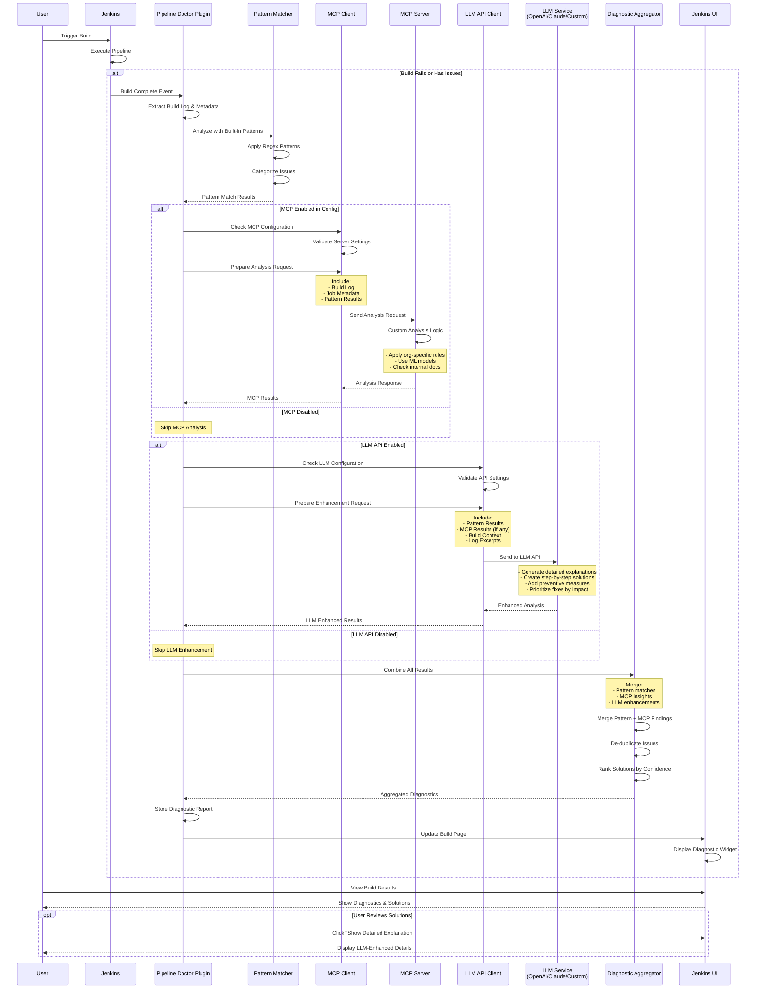
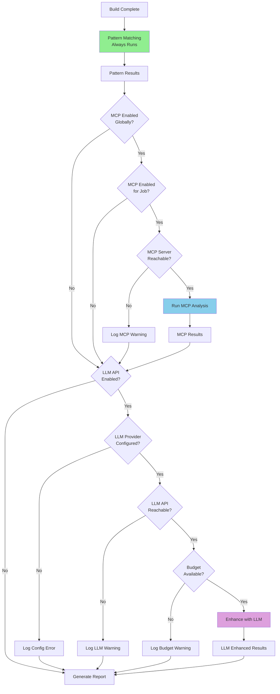
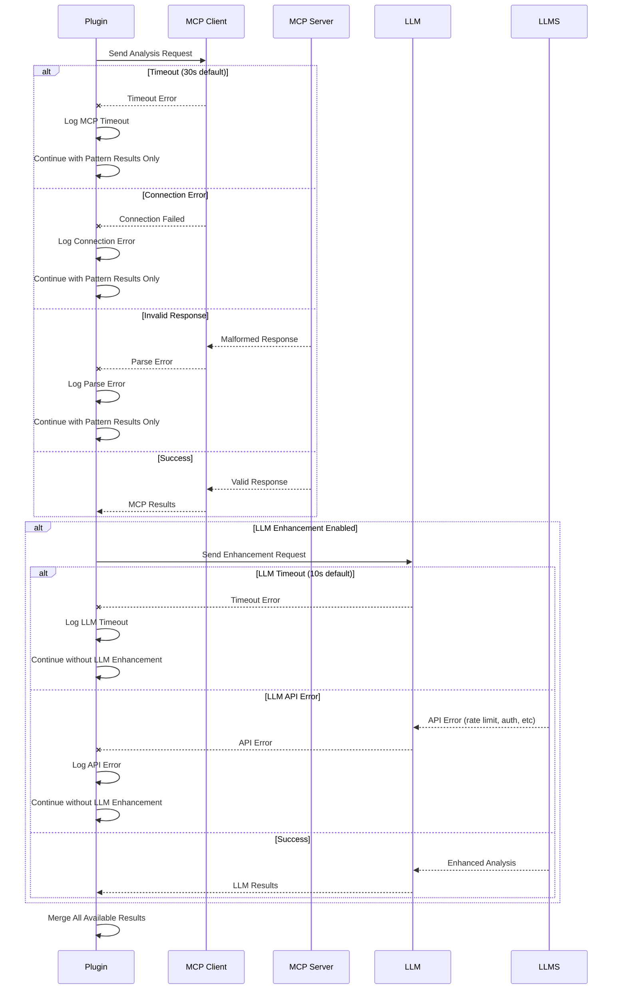
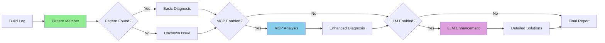
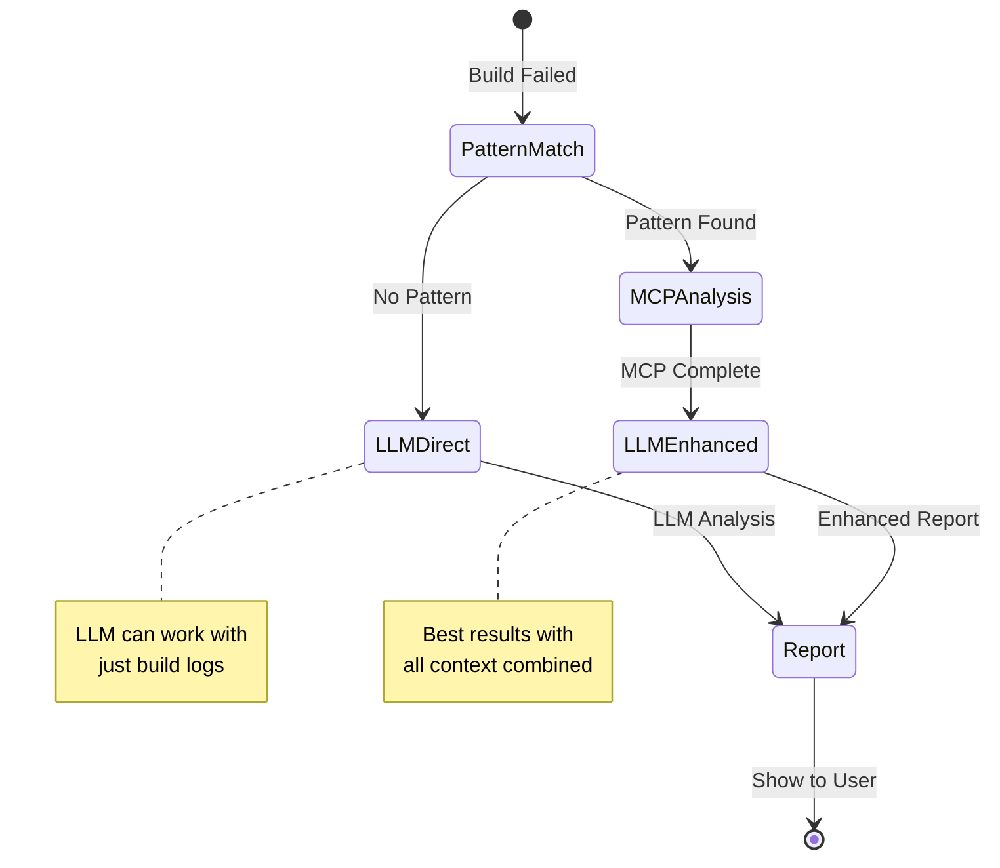

# Issue Analysis Strategy - Sequence Diagram

## Overview
This diagram shows how the Pipeline Doctor Plugin analyzes build issues using both built-in patterns and optional MCP server integration.

## Sequence Diagram



## Analysis Flow Details

### 1. Pattern Matching Phase (< 10ms)
- **Always executes** regardless of MCP configuration
- Uses pre-compiled regex patterns
- Handles common issues like:
  - Network timeouts
  - Docker registry errors
  - Permission failures
  - Compilation errors
  - Test failures

### 2. MCP Analysis Phase (1-5s)
- **Only runs if** MCP is enabled and configured
- Sends comprehensive context to MCP server
- Allows for:
  - Organization-specific pattern recognition
  - Complex multi-line log analysis
  - Historical context consideration
  - Custom ML model integration

### 3. LLM Enhancement Phase (2-10s)
- **Optional step** that runs after pattern matching and/or MCP analysis
- Can use OpenAI, Claude, or custom LLM endpoints
- Enhances results by:
  - Providing detailed explanations
  - Contextualizing solutions for specific environments
  - Generating step-by-step fix instructions
  - Prioritizing solutions based on context
  - Adding preventive recommendations

### 4. Result Aggregation
- Combines findings from all sources (Pattern, MCP, LLM)
- Prioritizes by confidence score
- Removes duplicate diagnoses
- Presents unified solution set with enhanced explanations

## Configuration Decision Points



### Configuration Levels

1. **Global Settings** (Jenkins System Configuration)
   - MCP Server URL and credentials
   - LLM Provider selection (OpenAI/Claude/Custom)
   - LLM API keys and endpoints
   - Default enable/disable for new jobs
   - Budget limits and rate limiting

2. **Folder-Level Settings**
   - Override global MCP/LLM settings
   - Apply to all jobs in folder
   - Useful for team-specific configurations

3. **Job-Level Settings**
   - Final override for specific jobs
   - Enable/disable MCP analysis
   - Enable/disable LLM enhancement
   - Custom timeout values

### Decision Logic Examples

```java
public class AnalysisDecisionMaker {
    public AnalysisStrategy determineStrategy(Job job) {
        AnalysisStrategy strategy = new AnalysisStrategy();
        
        // Pattern matching always enabled
        strategy.setPatternMatchingEnabled(true);
        
        // MCP decision
        if (globalConfig.isMcpEnabled() && 
            !job.getProperty(DisableMCPProperty.class).isDisabled() &&
            mcpClient.isReachable()) {
            strategy.setMcpEnabled(true);
        }
        
        // LLM decision
        if (globalConfig.isLlmEnabled() && 
            !job.getProperty(DisableLLMProperty.class).isDisabled() &&
            llmClient.isConfigured() &&
            budgetManager.hasRemainingBudget(job)) {
            strategy.setLlmEnabled(true);
        }
        
        return strategy;
    }
}
```

## Error Handling



## Performance Characteristics

| Component | Latency | Reliability |
|-----------|---------|-------------|
| Pattern Matching | < 10ms | 99.9% (local) |
| MCP Analysis | 1-5s | 95% (network dependent) |
| LLM Enhancement | 2-10s | 90% (API dependent) |
| Result Aggregation | < 5ms | 99.9% |
| Total (Pattern Only) | < 20ms | 99.9% |
| Total (Pattern + MCP) | 1-5s | 95% |
| Total (Pattern + LLM) | 2-10s | 90% |
| Total (All Three) | 3-15s | 85% |

## Key Benefits

1. **Fast Baseline**: Pattern matching provides immediate results
2. **Extensibility**: MCP allows custom analysis without plugin updates
3. **Intelligence**: Optional LLM enhancement for detailed explanations
4. **Graceful Degradation**: Works even if MCP or LLM fails
5. **User Control**: Per-job MCP and LLM enable/disable
6. **Privacy**: Sensitive data can stay on-premise with local MCP server
7. **Flexibility**: Choose between speed (pattern-only) or intelligence (with LLM)

## Example Analysis Flow



## Configuration Examples

### Scenario 1: Pattern-Only (Fastest)
```yaml
MCP: Disabled
LLM: Disabled
Result: Basic pattern matching only (~20ms)
Use Case: High-volume builds, cost-sensitive
```

### Scenario 2: Pattern + MCP
```yaml
MCP: Enabled (custom server)
LLM: Disabled
Result: Org-specific analysis (~1-5s)
Use Case: Complex internal systems
```

### Scenario 3: Pattern + LLM
```yaml
MCP: Disabled
LLM: Enabled (OpenAI GPT-4)
Result: AI-enhanced explanations (~2-10s)
Use Case: Developer-friendly detailed guides
```

### Scenario 4: Full Stack
```yaml
MCP: Enabled
LLM: Enabled
Result: Complete analysis (~3-15s)
Use Case: Critical builds, maximum insight
```

## LLM Integration Examples

### Sample LLM Enhancement Flow



### OpenAI Configuration
```java
// Jenkins Global Configuration
llmProvider = "openai"
llmApiKey = "${OPENAI_API_KEY}"
llmModel = "gpt-4"
llmTemperature = 0.3
llmMaxTokens = 2000
```

### Claude (Anthropic) Configuration
```java
// Jenkins Global Configuration for Claude
llmProvider = "anthropic"
llmApiKey = "${ANTHROPIC_API_KEY}"
llmModel = "claude-3-opus-20240229"  // or claude-3-sonnet, claude-3-haiku
llmMaxTokens = 4096
llmTemperature = 0.3

// Optional: Use Claude via AWS Bedrock
llmProvider = "bedrock-claude"
llmRegion = "us-east-1"
llmModel = "anthropic.claude-3-opus-20240229-v1:0"
// Uses AWS credentials from Jenkins credential store
```

### Custom LLM Endpoint
```java
// For self-hosted or alternative LLM services
llmProvider = "custom"
llmEndpoint = "https://llm.company.com/v1/analyze"
llmApiKey = "${CUSTOM_LLM_KEY}"
llmRequestFormat = "openai-compatible" // or "custom"
```

### LLM Request Examples

#### OpenAI Format
```json
{
  "messages": [
    {
      "role": "system",
      "content": "You are a Jenkins build failure expert. Analyze the issues and provide detailed solutions."
    },
    {
      "role": "user",
      "content": "Build failed with:\nPattern matches: [DOCKER_REGISTRY_TIMEOUT, NETWORK_UNREACHABLE]\nMCP analysis: {\"root_cause\": \"Corporate proxy blocking registry\"}\nProvide detailed fix steps."
    }
  ],
  "temperature": 0.3,
  "max_tokens": 2000
}
```

#### Claude (Anthropic) Format
```json
{
  "model": "claude-3-opus-20240229",
  "max_tokens": 4096,
  "temperature": 0.3,
  "system": "You are a Jenkins build failure expert. Analyze the issues and provide detailed solutions with clear, actionable steps.",
  "messages": [
    {
      "role": "user",
      "content": "Build failed with:\nPattern matches: [DOCKER_REGISTRY_TIMEOUT, NETWORK_UNREACHABLE]\nMCP analysis: {\"root_cause\": \"Corporate proxy blocking registry\"}\n\nPlease provide:\n1. Root cause explanation\n2. Step-by-step fix\n3. Prevention measures"
    }
  ]
}
```

#### Claude via AWS Bedrock Format
```json
{
  "modelId": "anthropic.claude-3-opus-20240229-v1:0",
  "contentType": "application/json",
  "accept": "application/json",
  "body": {
    "anthropic_version": "bedrock-2023-05-31",
    "max_tokens": 4096,
    "temperature": 0.3,
    "system": "You are a Jenkins build failure expert analyzing CI/CD issues.",
    "messages": [
      {
        "role": "user",
        "content": "Analyze this Jenkins build failure and provide solutions..."
      }
    ]
  }
}
```